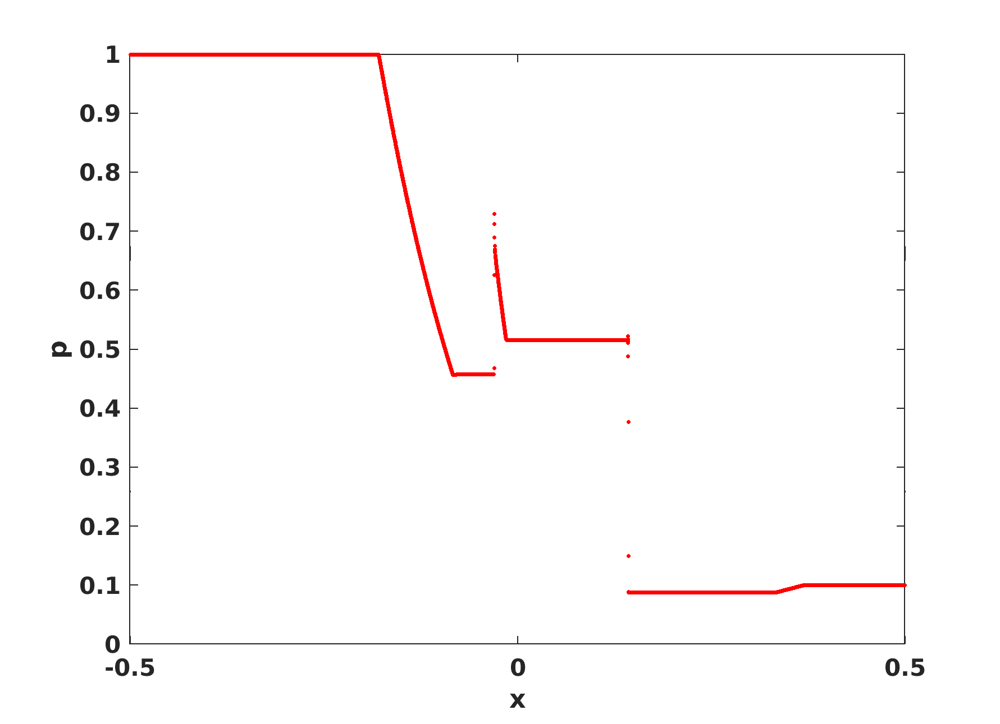

This test is an MHD shocktube (Brio and Wu, 1988, Ideal MHD Riemann problem), where the right and left states are initalized to different values.

(i) The left state is initialized as

and

(ii) the right state

(iii) In addition, .

The hydrodynamic portion of the initial conditions are the same as for the Sod shock tube problem.

This example tests whether the code can accurately represent the shocks, rarefactions, contact discontinuities, and the compound structures of MHD.
The test is now a standard for MHD codes.

Results computed with Athena++ using the "second order Roe solver" with 10,000 grid points. The plot shows from left
to right: a fast rarefaction (FR), a slow compound wave (CW), a contact discontinuity (CD), a slow shock (SS), and a fast rarefaction wave (FR). These results
can be compared to Fig. 2 in the reference.

The animation for the evolutions of primitive variables are shown below:

Reference:
https://www.sciencedirect.com/science/article/pii/0021999188901209?via%3Dihub
http://www.csun.edu/~jb715473/examples/mhd1d.htm (detailed description)
